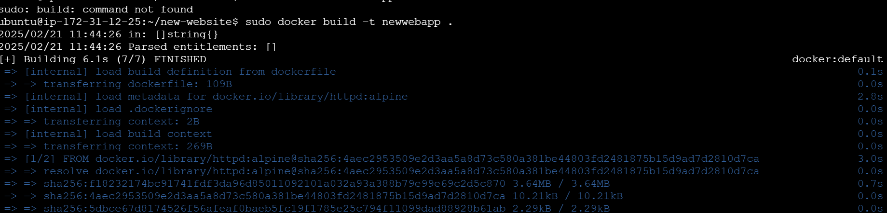
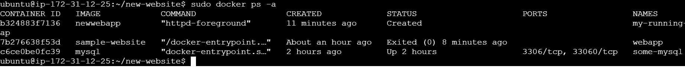
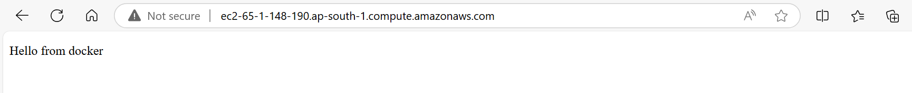

# My Apache Docker Project

This project sets up an Apache HTTP Server using Docker. It includes a simple `index.html` file served by the Apache server.

## Prerequisites

- Docker installed on your system.

## Files

- `Dockerfile`: Defines the Docker image.
- `index.html`: The HTML file to be served.

## Dockerfile

```Dockerfile
FROM httpd:alpine

COPY index.html /usr/local/apache2/htdocs/
EXPOSE 80

```
# Screenshot






# Final Screen
